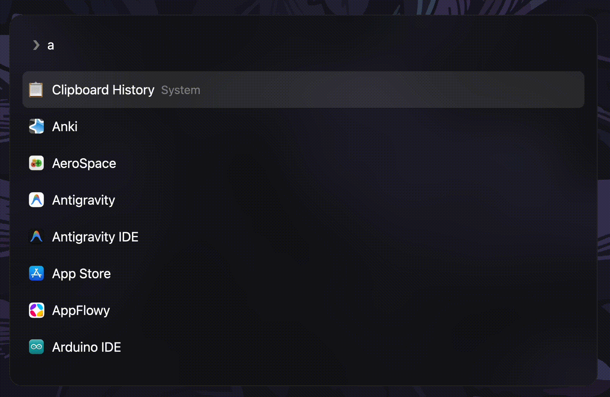

<div align="center">

# aerofi

**A blazing fast, keyboard-driven application launcher and extensible script runner for macOS, built with GPUI and Rust.**

[](https://github.com/frostymur/aerofi/releases)
[](https://github.com/frostymur/aerofi/actions)
[](https://apple.com)
[](https://www.rust-lang.org)
[](ARCHITECTURE.md)
[](ARCHITECTURE.md)
[](LICENSE)

<br />

[Features](#-key-features) •
[Installation](#-installation) •
[Quick Start](#-quick-start) •
[Customization](docs/customization.md) •
[Scripting](docs/scripts.md) •
[Native Plugins](docs/plugins.md) •
[Architecture](ARCHITECTURE.md)

</div>

---

<div align="center">
  
</div>

---

## ✨ Key Features

- ⚡ **Sub-2ms Hotkey Latency**: Built directly on [GPUI](https://github.com/zed-industries/zed) (the GPU-accelerated UI framework behind Zed) rendering natively at 120 FPS via Metal (~1–2ms warm path on Apple Silicon).
- 🪶 **Minimal Memory Footprint**: Strictly constrained memory budget—**~40 MB RSS idle, ~50 MB active**. Automatically frees GPU framebuffers when hidden.
- 🔑 **Zero-Friction Global Hotkey**: Uses native macOS Carbon FFI (`RegisterEventHotKey`) by default. **Requires no invasive Accessibility permissions** to install and run.
- 📜 **Full Raycast Script Compatibility**: Drop any existing Raycast script command into your scripts folder—aerofi natively parses `@raycast.title`, `@raycast.mode`, `@raycast.argument*`, and metadata annotations.
- 🛠️ **6 Script Execution Modes**:
  - `silent`: Detached background execution with floating toast status.
  - `compact`: Transient single-line progress indicator.
  - `inline`: Real-time output row displayed directly in the launcher list (great for battery, git, weather).
  - `fullOutput`: Rich in-app Markdown and ANSI terminal output viewer.
  - `pipe`: Captures output and copies directly to system clipboard (`pbcopy`).
  - `gui`: Persistent two-way interactive Rofi-compatible IPC protocol.
- 🔌 **Dynamic C ABI Plugins (`.dylib`)**: Build high-performance compiled extensions in Rust, C, C++, Zig, or Swift that load dynamically at runtime with zero overhead.
- 🎨 **Declarative TOML Theming**: Transparent styling system with true macOS frosted glass blur, custom paddings, borders, typography, and variable color palettes (includes Tokyo Night & Gruvbox Dark).
- 🚀 **Native macOS Service**: Run aerofi smoothly in the background as a daemon using `brew services`.

---

## 📦 Installation

### Homebrew (Recommended)

Install aerofi and start it as a background service:

```bash
# Tap repository
brew tap frostymur/aerofi https://github.com/frostymur/aerofi

# Install aerofi
brew install aerofi

# Start aerofi as a background service (starts automatically on login)
brew services start aerofi
```

To stop the background service:
```bash
brew services stop aerofi
```

---

### Building from Source

Ensure you have Rust (stable 2024 edition) and Xcode Command Line Tools installed:

```bash
# Clone the repository
git clone https://github.com/frostymur/aerofi.git
cd aerofi

# Build the release binary
cargo build --release

# Install locally
cargo install --path .
```

---

## 🚀 Quick Start

1. **Open aerofi**: Press `Option+Space` (default global toggle).
2. **Search**: Start typing to fuzzy-search across your Applications and scripts.
3. **Launch**: Press `Enter` to open an application or run a script.
4. **Reload**: Press `Cmd+R` or search for `Reload Configuration` to reload your config and themes instantly.

---

## 📚 Documentation

| Guide | Description |
|---|---|
| ⚙️ **[Customization Guide](docs/customization.md)** | `config.toml` reference, keybindings, aliases, app exclusions, and theming engine. |
| 📜 **[Scripting & GUI Protocol](docs/scripts.md)** | Raycast compatibility, 6 execution modes, bidirectional GUI protocol, and Pango styling. |
| 🔌 **[Native Plugins Guide](docs/plugins.md)** | Developing C ABI dynamic `.dylib` plugins in Rust/C with `aerofi-plugin-api`. |
| 🏛️ **[Architecture Decisions](ARCHITECTURE.md)** | System layers, GPUI policies, memory limits, and design principles. |
| 🤝 **[Contributing Guide](CONTRIBUTING.md)** | Developer workflow, signing keys, code quality standards, and PR guidelines. |

---

## ⌨️ Default Shortcuts

| Shortcut | Context | Action |
|---|---|---|
| `Option+Space` | Global | Toggle aerofi launcher window |
| `↑` / `↓` (or `Ctrl+P` / `Ctrl+N`) | Launcher | Navigate result list |
| `Enter` | Launcher | Launch highlighted item |
| `Cmd+R` | Launcher | Reload configuration and rescan sources |
| `Escape` | Launcher | Close aerofi window / Clear search |
| `Tab` | GUI Mode | Toggle multi-selection checkbox |
| `Ctrl+D` | GUI Mode | Secondary action (e.g. delete item) |

---

## 🎨 Themes Showcase

aerofi comes bundled with curated modern themes in `~/.config/aerofi/themes/`:

| Theme | Description |
|---|---|
| **Tokyo Night** | Deep indigo surfaces with neon cyan & sky blue accents and frosted glass blur. |
| **Gruvbox Dark** | Warm vintage retro-groove palette with high contrast and earthy tones. |
| **Dark Transparent** | Minimalist semi-translucent dark monochrome design. |

*See [docs/customization.md](docs/customization.md) for instructions on creating and customizing themes.*

---

## 🤝 Contributing

Contributions are welcome! Please check out [CONTRIBUTING.md](CONTRIBUTING.md) for details on code style, testing requirements, and cryptographic commit signing.

---

## 📄 License

aerofi is open-source software licensed under the [MIT License](LICENSE).
